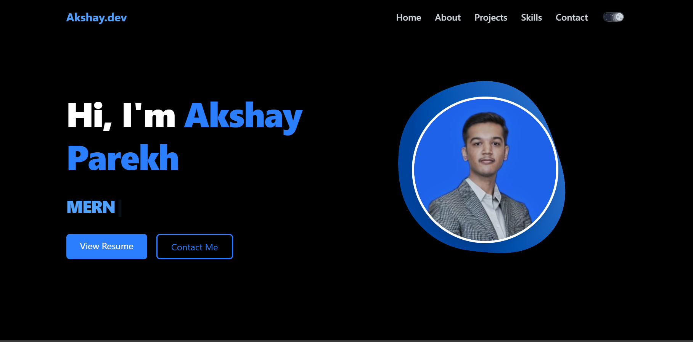

# Akshay Parekh | Developer Portfolio 🚀

> A modern, responsive portfolio website to showcase my skills, projects, and contact information. Built with React, Tailwind CSS, Vite, Three.js, and AOS for stunning UI animations and interactions.

 <!-- optional if you add a banner -->

## 🌐 Live Demo

[🔗 Visit Portfolio](https://akshay.dev) <!-- Replace with your actual deployed link -->

---

## 🛠️ Tech Stack

- **Frontend**: React.js, Tailwind CSS, JavaScript (ES6+)
- **3D Animation**: Three.js via `@react-three/fiber` and `drei`
- **UI Animation**: AOS (Animate on Scroll)
- **Backend Projects** (Showcased): Core PHP, Laravel, JSP, Servlet, Node.js + Express
- **Other Tools**: Vite, EmailJS, Git & GitHub, Postman

---

## ✨ Features

- 🔹 Fully responsive for all devices
- 🔹 Animated hero section with typing and 3D visuals
- 🔹 Projects displayed using object-based structure (easy to add/edit), each with image, description, tech stack, and GitHub link
- 🔹 Skills section with category-based filters (All, Languages, Frontend, Backend, Database, Tools)
- 🔹 Contact form integrated with **EmailJS**
- 🔹 Dark mode toggle
- 🔹 SEO-ready with meta tags and favicon

---

## 📦 Getting Started

### 1. Clone the repository

```bash
git clone https://github.com/yourusername/akshay-portfolio.git
cd akshay-portfolio
